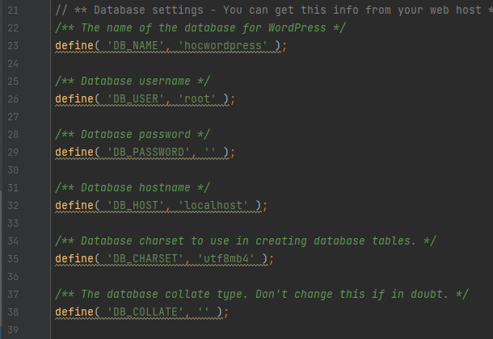

To run the website, you can follow these steps:
- Step 1: Install the web server environment
  - First, you need to install Xampp 8.0.25 from the website https://www.apachefriends.org/download.html. After installation, open the htdocs folder in the Xampp directory and continue with Step 2.
- Step 2: Download the project
  - You need to clone the project from git https://github.com/NguyenTrongDuc256/wp-waocon.git and save it to the htdocs folder opened in the previous step.
- Step 3: Run Xampp and create a database
  - Start Xampp and run Apache and MySQL in Xampp. Then, access the administration page http://localhost/phpmyadmin/ to create a database for the website.
  - To create a database, you need to create a new database named "hocwordpress" and then import the "hocwordpress.sql" file provided in the project folder.
- Step 4: Connect the database to the project
  - To connect the database to the project, open the wp-config.php file in the project folder and enter the information as shown in the image below:
  
- Step 5: Access the website
  - Finally, to access the website, simply enter the address http://localhost/wp-waocon/ in your web browser.
- With these steps, you have successfully installed the website and can use it.

 